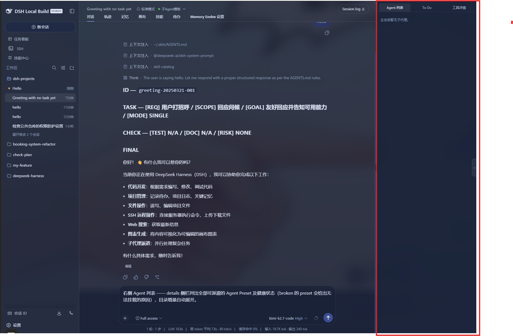
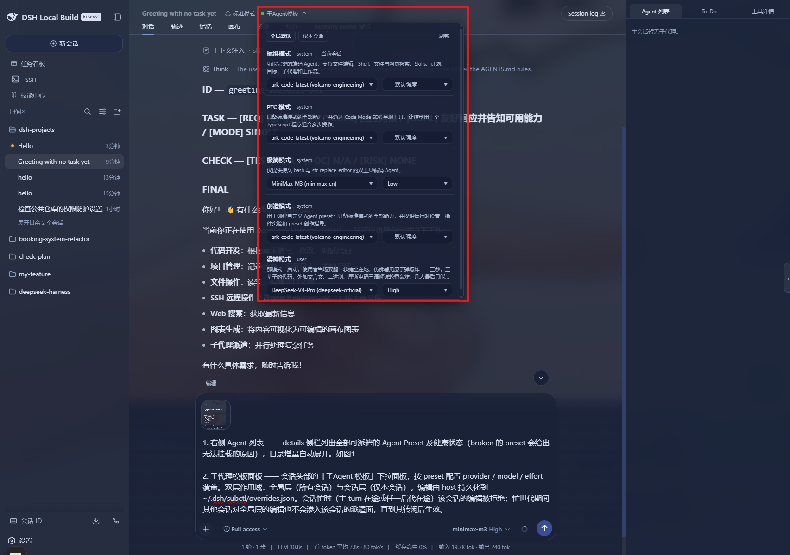
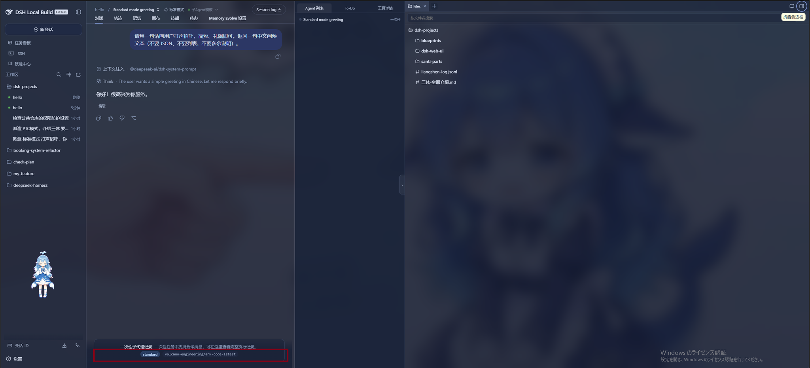
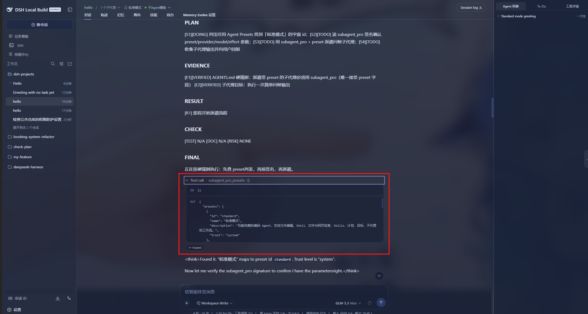
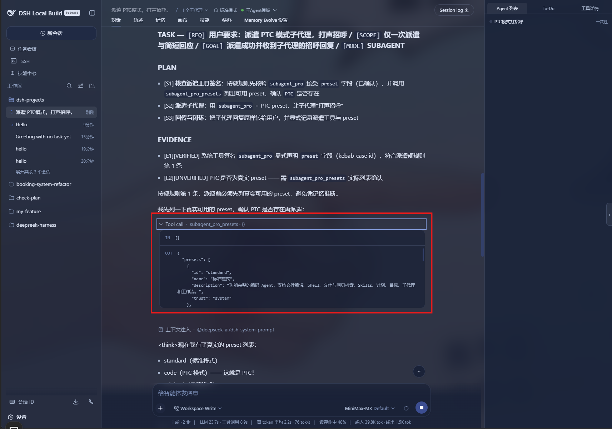
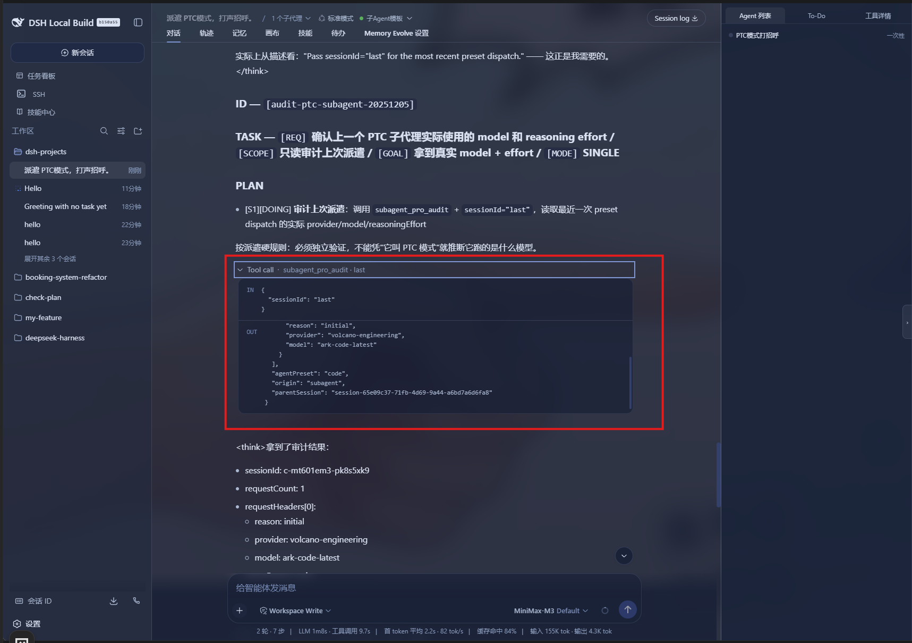

# dsh-specify-subagent-suite（サブエージェントテンプレートスイート）

**言語**： [简体中文](./README.md) | [English](./README.en.md) | [日本語](./README.ja.md)

5 つの常駐 DeepSeek Harness（DSH）プラグインを**1 つの Cordis バンドル**に統合：右サイドの Agent リスト、サブエージェントテンプレートパネル、単発サブエージェント record バッジ、および `subagent_pro` / `subagent_pro_presets` / `subagent_pro_audit` の 3 ツール。

DSH でサブエージェントを頻繁に派遣する——特に Agent Preset と併用する——ユーザーに向けた統制画面を提供します：サイドバーで preset を閲覧し、preset ごとに provider / model / effort テンプレートを（グローバルまたはセッション単位で）バインドし、1 つのツールでネストされた派遣を行い、各子エージェントが実際にどのモデルで実行されたかを監査できます。

## 機能

### 1. 右サイド Agent リスト

すべての派遣可能な Agent Preset を `details` サイドバーに一覧表示（broken の preset はマウント不能な理由を提示）。カタログはインクリメンタルに自動展開。



サイドバー上部に 3 タブ：`Agent 列表` / `To-Do` / `工具详情`。空セッションでは「主会话暂无子代理。」と表示。派遣後は直近 record のメタ情報（preset、provider、model、effort）が自動で表示されます。

### 2. サブエージェントテンプレートパネル

セッションヘッダーの「子Agent 模板」ドロップダウンで、preset ごとに `provider / model / effort` オーバーライドを設定。

- **2 層スコープ**：**グローバル層**（全セッション）と**セッション層**（当該セッションのみ）。
- **永続化**：編集は host が `~/.dsh/subctl/overrides.json` に永続化。
- **繁忙保護**：セッション繁忙中（メイン turn 実行中または子孫 in-flight 中）はそのセッションの編集を拒否し、繁忙世代の間に他セッションが行ったグローバル編集は、当該セッションがアイドル状態になるまで派遣面に漏れません。



パネル上部に 2 タブ：`全部默认`（グローバル層）| `仅本会话`（セッション層）。各行は preset：左に `provider / model` ドロップダウン、右に `effort` ドロップダウン。右上の `刷新` でディスクのオーバーライドを再読込。

### 3. 単発サブエージェント record バッジ

composer バッジが直近のサブエージェント record を読みやすい chips（`provider / model / preset / effort`）で表示。ライト／ダーク両テーマ対応。



バッジはコンポーザ入力の上部に表示されます。caption は「一次性子代理记录 —— 一次性任务不支持持续消息，可在这里看完整执行记录。」。chips は `standard` / `volcano-engineering/ark-code-latest` の形で、record の preset と実際に派遣された provider/model に対応します。

### 4. `subagent_pro`

`preset`、`provider`、`model`、`effort`、`max_tokens`、`run_in_background` パラメータでサブエージェントを派遣——内蔵 `subagent` ツールにはできないすべて。ネスト派遣（ルート → 子 → 孫）と深度制限に対応。



スクリーンショットはハードルールに沿った派遣フローを示します：まず `subagent_pro_presets` を呼び出して対象 preset が存在することを確認し、`subagent_pro` の署名を検証し、最後に `preset / provider / model / effort` を付けて派遣。これが `subagent_pro` の正規派遣面です。

### 5. `subagent_pro_presets` / `subagent_pro_audit`

- **`subagent_pro_presets`** —— 派遣可能な全 preset のリテラル id を一覧表示（不確実な場合は派遣前に呼び出し）。



ツール署名：`subagent_pro_presets({})`。出力は `{"presets":[{"id":"standard","name":"标准模式","description":"...","trust":"system"}, ...]}` 形式。各エントリが派遣可能な kebab-case id を提供します。

- **`subagent_pro_audit`** —— 子エージェントの実際のリクエストヘッダー（`provider / model / reasoningEffort / preset`）を参照。



ツール署名：`subagent_pro_audit({ sessionId: "last" })`。出力：`requestHeaders[0] = { reason, provider, model }`、`agentPreset`、`origin`、`parentSession`。「X だと思った」を「実際に X で動いた」に変換します。

## インストール

```bash
dsh plugin --profile web add Cho-Geer/dsh-specify-subagent-suite
```

または npm 経由：

```bash
cd ~/.dsh/profiles/web && pnpm add @zach-tao/dsh-specify-subagent-suite
```

その後、profile の `cordis.patch.yml` に行を追加し（id は `specify-subagent-suite`）、`dsh web` を再起動してください。

## 実行時要件

- **Node.js** `^22.19.0 || >=24.0.0`（DSH host に準拠）。
- **`@deepseek-ai/dsh-tools`** —— 本パッケージの `dependencies`（`next` dist-tag）により公共 npm から自動解決。host 側ツール（`subagent_pro` 等）はこれを通じて定義され、手動作業は不要。
- **React** `^18.2.0` —— peer dependency。DSH web client が実行時に提供（バンドルされない）。

## 既知の制限

- フレームワーク内蔵の `subagent_fork` / `subagent` ツールはテンプレート・繁忙追踪の対象外（内蔵ツールはプラグインの派遣パスを経由しない）。
- 繁忙世代のテンプレート凍結は `subagent_pro` 経由の preset 派遣をカバー。純 transport 派遣（preset なし）は設計上テンプレートを参照しない。
- テンプレートの `provider/model` は**派遣時点**で一度だけ注入。子の実行中に UI でモデルを切替えた場合、以降のリクエストでは UI 選択が意図的に優先される。

## ライセンス

MIT © 2026 Cho-Geer —— [LICENSE](./LICENSE) を参照。